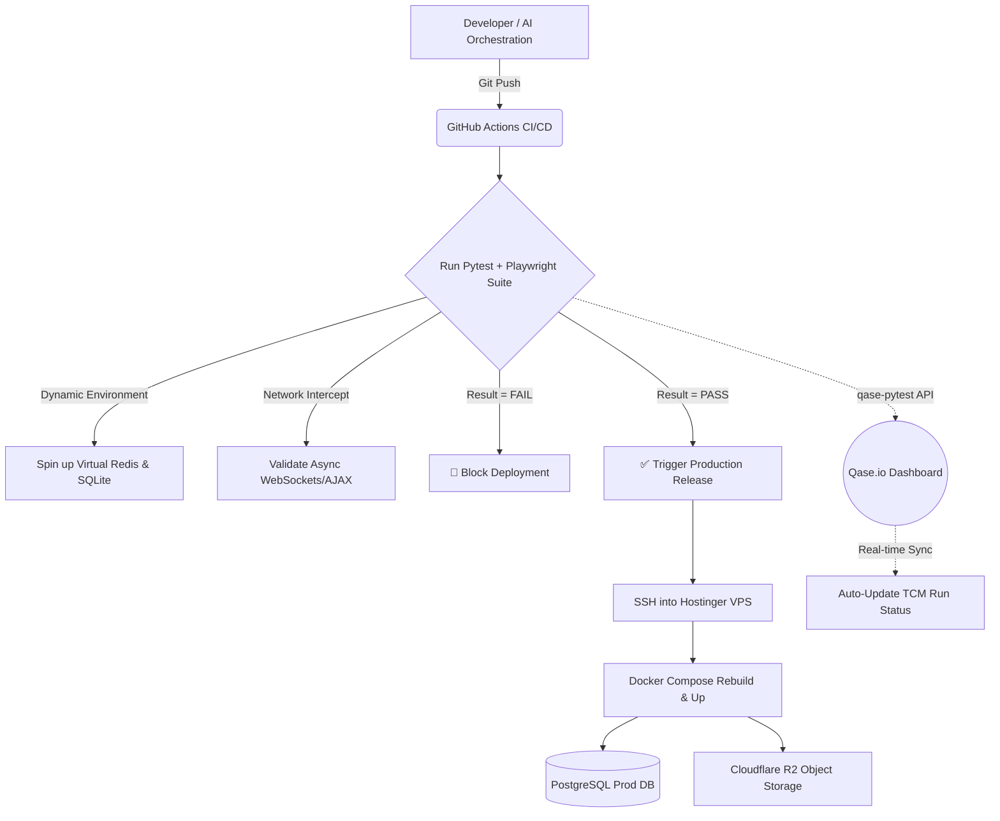

# 🤖 AI-Architected Enterprise Recipe Platform & Quality Ecosystem

> **Live Production Environment:** [🔗 www.isharerecipe.com](https://www.isharerecipe.com)  
> **Architecture Demo & Qase Report Video:** [🔗 Watch on YouTube/Loom](https://youtu.be/dB6BY_uTOJg)

## 🎯 Project Overview

This project is a full-stack, real-time recipe-sharing application built entirely from scratch utilizing **AI-Driven Development (AIDD)** and advanced **Prompt Engineering**. 

As an **AI QA Automation Architect & DevOps Engineer**, my goal was not just to write code, but to orchestrate Large Language Models (LLMs) to architect the underlying infrastructure, secure cloud integrations, and establish an impenetrable **Zero-Touch Deployment CI/CD pipeline**. 

This repository serves as a Proof of Concept (PoC) for next-generation Quality Engineering, where automated testing, infrastructure as code (IaC), and Test Case Management (TCM) are seamlessly integrated.

---

## 🔒 Repository Scope & IP Disclaimer

> **Note to Recruiters & Engineering Managers:** This repository serves specifically as a **Quality Engineering & DevOps Showcase**.

The target application ([www.isharerecipe.com](https://www.isharerecipe.com)) is a live, commercial product serving a real user community. To protect Intellectual Property (IP), business logic, and production security, the core backend (Django) and frontend source code are securely maintained in a **Private Repository**.

However, transparency in Quality Engineering is critical. To demonstrate my architectural capabilities, I have explicitly extracted and open-sourced this **Quality Ecosystem**. Inside this repository, you will find the exact, production-grade files that act as the gatekeeper for our real-world deployments:

* **`.github/workflows/deploy.yml`**: The AI-generated, Zero-Touch CI/CD pipeline.
* **`tests/`**: The comprehensive E2E automation suite utilizing Playwright, Pytest, and dynamic Network Interception.
* **`requirements-test.txt`**: The isolated dependency mapping ensuring production server safety.
* **`pytest.ini`**: The core configuration for the test execution environment.

This structure reflects true Enterprise best practices: separating proprietary business logic from open, auditable quality and deployment infrastructure.

## 🏗️ System Architecture & CI/CD Flow

The deployment philosophy strictly enforces **Immutable Infrastructure** and **Zero-Touch Deployment**. No manual SSH interventions are allowed. Every code push must pass a rigorous automated regression suite before reaching production.

*(If the mermaid diagram doesn't render, it illustrates the flow: Code Push -> GitHub Actions -> Pytest/Playwright (with Redis) -> Qase TCM Auto-Update -> Conditional SSH Deploy to VPS -> Docker Compose Production).*

---

## 🛡️ Quality Engineering & Automation Strategy

The E2E test suite goes beyond basic DOM validation, tackling complex, modern web application challenges:

### 1. Network Interception for Asynchronous Real-Time Data (Django Channels)
Standard UI automation often suffers from flakiness when dealing with WebSockets. Instead of using hardcoded `sleep()` functions, the Playwright framework utilizes `expect_response` to intercept and wait for explicitly successful HTTP 200/WebSocket payloads before validating the UI, ensuring **100% test stability**.

### 2. Dynamic Test Data Generation (Pillow)
To validate the backend's WebP image compression logic without bloating the Git repository with static image files, the Pytest suite dynamically generates `.jpg` assets in-memory during runtime, uploads them via the UI, and automatically cleans them up post-execution.

### 3. Automated Test Case Management (TCM) Synchronization
Integrated **Qase.io** directly into the GitHub Actions pipeline via the `qase-pytest` library. Every CI/CD run automatically pushes results to the Qase dashboard, providing stakeholders with a live, Single Source of Truth for test coverage and pass rates without manual reporting.

---

## ☁️ DevOps & Cloud Security Architecture

* **Zero-Touch Deployment:** Handled entirely by `.github/workflows/deploy.yml`. The VPS automatically pulls, rebuilds, and restarts Docker containers only when the `test` job passes.
* **Separation of Concerns (Dependencies):** Production environments are kept lightweight and secure by separating requirements (`requirements.txt` for Prod vs. `requirements-test.txt` for CI/CD), preventing testing tools from reaching the VPS.
* **Cloud Object Storage (Cloudflare R2):** Configured `django-storages` and `boto3` for scalable media handling, completely decoupled from local server storage.
* **Enterprise Secrets Management:** All sensitive data (VPS Host, SSH Keys, DB Credentials, Cloudflare R2 Keys, Qase API Tokens) are strictly provisioned via **GitHub Secrets** and `.env` files. No credentials exist in the codebase.
* **ID Masking:** Implemented `Hashids` to mask database primary keys in URLs, preventing enumeration attacks and enhancing application security.

---

## 📸 Quality Assurance Dashboards

### Qase.io Automated Test Run Reporting

### GitHub Actions CI/CD Gatekeeper

---

## 📂 How to Navigate This Repository

Since this is an architectural showcase, you cannot spin up the application locally. However, you can audit the engineering quality by reviewing the following core components:

1. **The CI/CD Gatekeeper:** Navigate to `.github/workflows/deploy.yml` to see the Zero-Touch deployment logic, environment variable provisioning, and Redis service integration.
2. **Network Interception & Async Tests:** Review `tests/` directory to see how Playwright intercepts WebSocket and AJAX responses (`expect_response`) before asserting DOM changes, eliminating test flakiness.
3. **Dynamic Test Data:** Check the Pytest fixtures in the `tests/test_regression.py` to see how images are generated on-the-fly using `Pillow` for testing upload features without relying on static assets.

---

*Architected by **Athur Nguyen** | Quality Engineer Lead & AI Automation Architect* 📧 [Contact Me](mailto:arthurjobarlert@gmail.comm) | 💼 [LinkedIn](https://www.linkedin.com/in/arthurnguyen92/)
